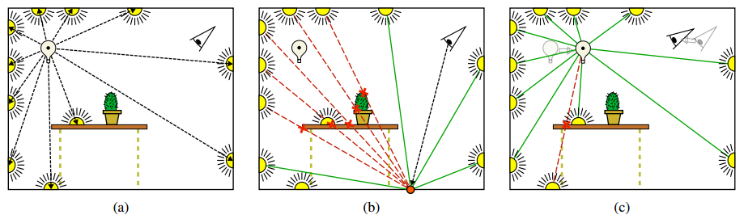

# Incremental Instant Radiosity
---
## Introduction
This goal of this project isto simulation the global illumination in real-time. Instant Radiosity is fundamental techniques to do it. However, its efficiency is still limited. In addition to regenerating all point light sources, incremental instant radiosity is porposed for rendering single-bounce indirect illumination in real time on currently available graphics hardware.
The method is based on the instant radiosity algorithm, where virtual point lights (VPLs) are generated by casting rays from the primary light source.

It's important to justistify the existence of each VPLs because the generation rays may be occluded due to the movement of the light sources and objects(A). Next step, it's to remove all invalid VPLs (B), and also adjust the contribution of valid VPLs(C).

## Video Link
